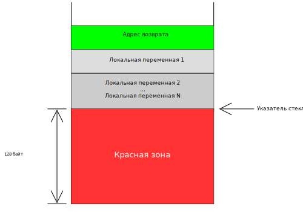
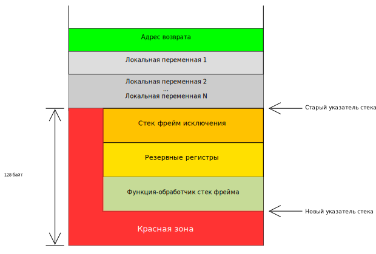

# Отключение красной зоны

Красная зона - это оптимизация [System V ABI], которая позволяет функциям временно использовать 128 байтов ниже стек фрейма без изменения указателя стека:



На изображении показан стековый фрейм функции с локальными переменными. При входе в функцию указатель стека устанавливается после адреса возврата и локальных переменных.

Красная зона располагается в 128 байтах после указателя стека. Функция может использовать эту область для временных данных, которые не нужны вызывающей стороне. Благодаря этому в некоторых случаях можно использовать одну инструкцию вместо двух, например, в небольших leaf-функциях (т. е. не выполняющих других вызовов).

Однако такая оптимизация приводит к огромным проблемам с исключениями и аппаратными прерываниями. Предположим, что возникло исключение, когда функция использовала красную зону:



Процессор и обработчик исключений перезаписывают данные в красной зоне. Но эти данные все еще нужны прерванной функции. Из-за этого функция будет работать неправильно, когда ей вернется управление после обработки исключения.

Чтобы избежать таких ошибок, когда мы будем реализовывать обработку исключений, сразу отключим красную зону:

```json
// в x86_64-blog_os.json
{
    // ...
    "disable-redzone": true,
}
```

[System V ABI]: (https://wiki.osdev.org/System_V_ABI)
