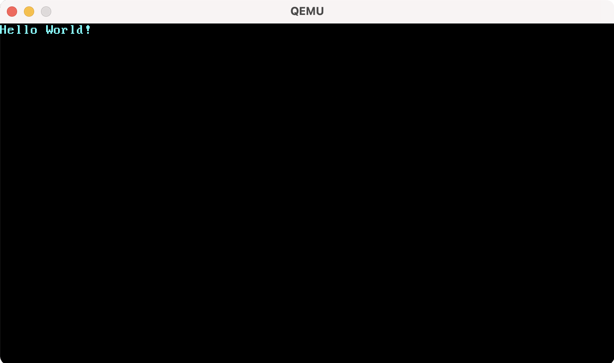

# Запуск нашего ядра

Теперь, когда у нас есть исполняемый файл, который делает что-то ощутимое, пришло время его запустить. Чтобы это сделать, нам нужно превратить наше скомпилированное ядро в образ загрузочного диска, связав его с загрузчиком. После этого мы сможем запустить его на виртуальной машине [QEMU] или на реальном устройстве с помощью USB-накопителя.

## Создание образа загрузочного диска

Чтобы превратить наше скомпилированное ядро в образ загрузочного диска, нам нужно связать его с загрузчиком.

[section about booting]: #the-boot-process

Вместо написания нашего собственного загрузчика, мы воспользуемся крейтом [`bootloader`]. Этот крейт создан на чистом Rust и ассемблерных вставках без внешних зависимостей от Си. Чтобы использовать `bootloader` в нашем ядре, нам достаточно добавить его в зависимости нашего крейта:

[`bootloader`]: https://crates.io/crates/bootloader

```toml
# в Cargo.toml

[dependencies]
bootloader = "0.9.8"
```

Добавления `bootloader`в качестве зависимости крейта недостаточно для создания образа загрузочного диска. Наше ядро необходимо связать с загрузчиком после компиляции. К сожалению, cargo не поддерживает [сценарии после сборки][post-build scripts].

[post-build scripts]: https://github.com/rust-lang/cargo/issues/545

Чтобы решить эту проблему, существует инструмент под названием `bootimage`, который сначала компилирует наше ядро и загрузчик, а затем упаковывает их вместе в образ загрузочного диска. Установить `bootimage` можно с помощью команды:

```console
$ cargo install bootimage
```

Для запуска `bootimage` и сборки загрузчика вам необходимо установить `llvm-tools-preview`. Сделать это можно командой:

```console
$ rustup component add llvm-tools-preview
```

После установки `bootimage` и `llvm-tools-preview`, мы можем создать образ загрузочного диска с помощью команды:

```console
$ cargo bootimage
```

`bootimage` перекомпилирует наше ядро с помощью `cargo build`, поэтому он автоматически отслеживает любые изменения в вашем крейте. После этого он компилирует загрузчик, что может занять некоторое время. Как и все зависимости крейта, загрузчик будет скомпилирован однажды и закеширован, поэтому последующие сборки крейта будут занимать меньше времени. После того, как все будет скомпилировано, `bootimage` упакует ядро вместе с загрузчиком в образ загрузочного диска.

После выполнения команды у вас появится долгожданный образ загрузочного диска с именем `bootimage-blog_os.bin` в каталоге `target/x86_64-blog_os/debug` . Вы можете запустить его на виртуально машине или скопировать на USB-носитель и запустить на настоящем устройстве. (Обратите внимание, что это не образ CD-диска, который имеет другой формат, поэтому его запись на CD-диск не работает).

## Как это работает

The `bootimage` tool performs the following steps behind the scenes:
За кулисами `bootimage` выполняет следующие шаги:

- Он компилирует наше ядро в [ELF]-файл.
- Он компилирует загрузчик как отдельный исполняемый файл.
- Он связывает байты [ELF]-файла ядра с загрузчиком.

[ELF]: https://en.wikipedia.org/wiki/Executable_and_Linkable_Format
[rust-osdev/bootloader]: https://github.com/rust-osdev/bootloader

When booted, the bootloader reads and parses the appended ELF file. It then maps the program segments to virtual addresses in the page tables, zeroes the `.bss` section, and sets up a stack. Finally, it reads the entry point address (our `_start` function) and jumps to it.

При загрузке загрузчик читает и анализирует добавленный ELF-файл. Затем он сопоставляет сегменты программы с виртуальными адресами в таблицах страниц, обнуляет раздел `.bss` и устанавливает стек. В конце он считывает адрес точки входа (наша функция `_start`) и переходит к нему.

## Запуск на QEMU

Одним из способов загрузки образа диска является использование виртуальной машины [QEMU]. Запустим наше ядро с помощь команды:

[QEMU]: https://www.qemu.org/

```console
$ qemu-system-x86_64 -drive format=raw,file=target/x86_64-blog_os/debug/bootimage-blog_os.bin
```

После запуска у вас откроется примерно такое окно:



Мы видим, что наш "Hello World!" отображается на экране.

## Запуск на настоящем устройстве

Также можно записать полученный образ диска на USB-накопитель и загрузить нашу ОС на реальном устройстве:

```console
$ dd if=target/x86_64-blog_os/debug/bootimage-blog_os.bin of=/dev/sdX && sync
```

Где `sdX` — имя вашего USB-накопителя. **Будьте внимательны** при выборе имени устройства, потому что перед записью образа накопитель будет отформатирован.

После записи образа на USB-накопитель вы можете запустить нашу небольшую ОС на реальном устройстве. Возможно вам может потребоваться указать загрузочное устройство в настройках BIOS.

## Используем `cargo run`

Запуск нашего ядра в QEMU можно упростить, попросив cargo делать все за нас:

```toml
# в .cargo/config.toml

[target.'cfg(target_os = "none")']
runner = "bootimage runner"
```

Настройки под атрибутом `target.'cfg(target_os = "none")'` применяются ко всем целям, у которых поле `"os"` в их конфигурационном файле выставлено в значение `"none"`, в том числе и наша цель `x86_64-blog_os.json`. Ключ `runner` определяет команду, которая должна быть вызвана при `cargo run`. Эта команда запускается после успешной сборки. Выполняемой команде первым аргументом передается путь к исполняемому файлу. Больше информации можно узнать в [документации cargo][cargo configuration].

The `bootimage runner` command is specifically designed to be usable as a `runner` executable. It links the given executable with the project's bootloader dependency and then launches QEMU. See the [Readme of `bootimage`] for more details and possible configuration options.

Команда `bootimage runner` специально разработана для автоматизированного запуска нашего ядра в QEMU. Подробнее можно узнать в [readme `bootimage`][bootimage-readme.

[bootimage-readme]: https://github.com/rust-osdev/bootimage

Теперь мы можем использовать `cargo run` для компиляции и запуска нашего ядра в QEMU.
